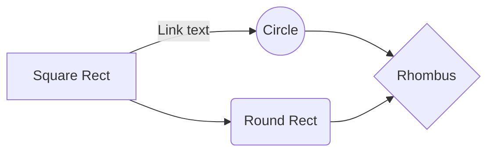

# notes
My experience about IT World



```ascii	
+------------------------------------------------+
|                                                |
|                                                |
|                                                |
|                                                |
|                                                |
|                                                |
|                                                |
|                                                |
|                                                |
|                                                |
|                                                |
|                                                |
|                                                |
|                                                |
|                                                |
+------------------------------------------------+

```


<!--stackedit_data:
eyJoaXN0b3J5IjpbMTYzNDU0ODMxMywyNzgzOTkwMzQsMTIzOD
A1OTkwMCwxMjM4MDU5OTAwXX0=
-->